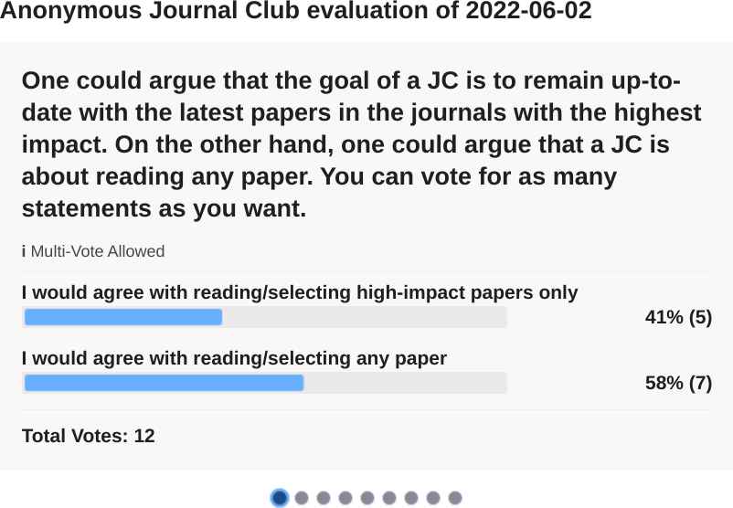
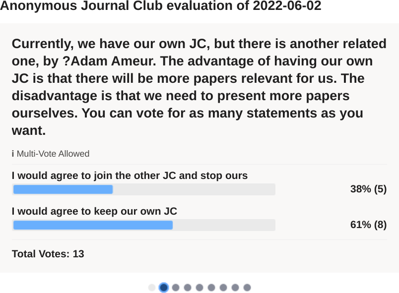
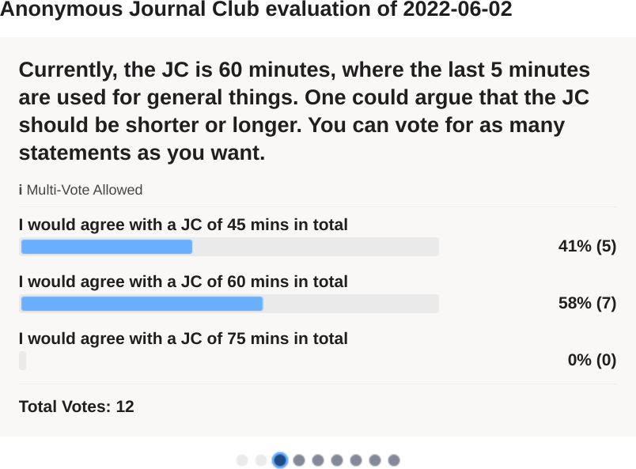
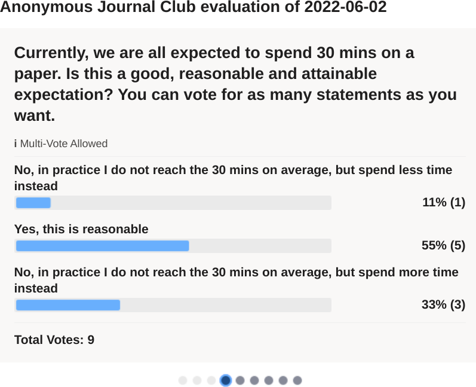
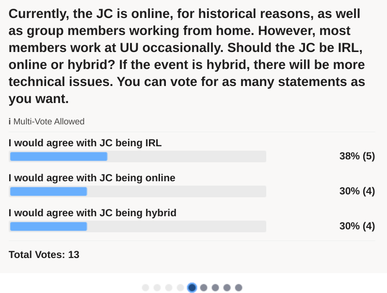
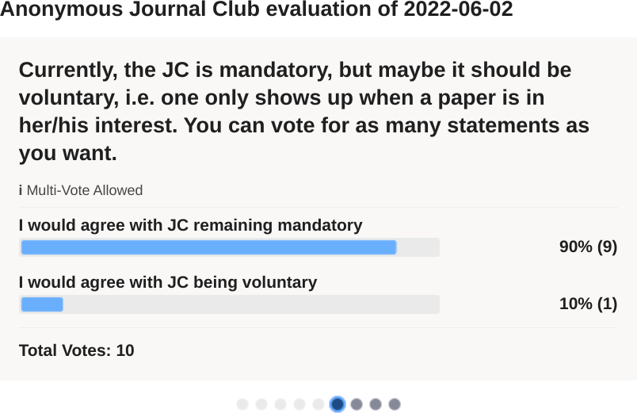
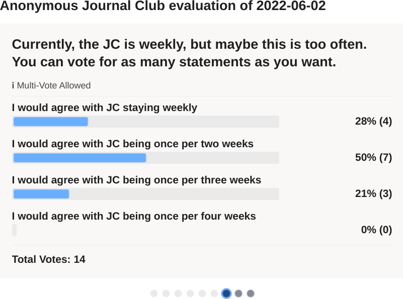
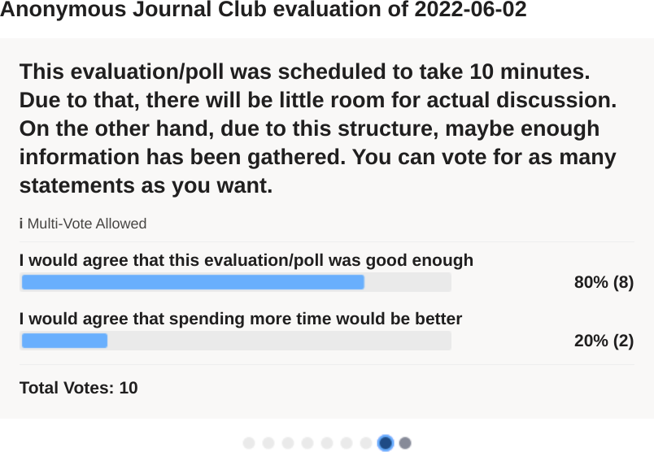

# Evaluation 2022-06-13

The majority wants:

 * to select any paper to present
 * keep our own JC
 * keep it at 60 mins
 * keep using 30 mins to read
 * do it IRL (i.e. not hybrid)
 * keep it mandatory
 * have it once per two weeks
 * to have a short poll like this

## Results

These results are from cropped screenshots from Polly.

### Question 1

### Question 2

### Question 3

### Question 4

### Question 5

### Question 6

### Question 7

### Question 8

### Question 9

> Are there any other comments. Please make your own writing anonymous (e.g. by adding grammar error, typos, translating to Finish, then Polish, then English), or put in the discussion of the next group meeting

Here are the rewritten/anonimized answers:

> Instead of joining another JC, we could merge instead
> Joining another JC would be good/bad depending on the focus of that JC
> We could invite others to join our JC

